<h1 align="center">Hi 👋, I'm keaikeqing</h1>
<h3 align="center">A passionate developer from China</h3>

<p align="left">  </p>

<p align="left"> <a href="https://github.com/ryo-ma/github-profile-trophy"></a> </p>

- 🔭 I’m currently working on [keaikeqing.github.io](blog.keaikeqing.me)

- 🌱 I’m currently learning **LLM WinUI Android Web**

- 📝 I regularly write articles on [blog.keaikeqing.me](blog.keaikeqing.me)

- 📫 How to reach me **<keaikeqing@gmail.com>**

<!-- 图片附加 -->
<p align="left">  </p>

<!-- <h5 align="left">Connect with me:</h5>
<p align="left">
<a href="https://leetcode.cn/u/keaikeqing/" target="blank"></a>
</p> -->

<h5 align="left">Languages and Tools:</h5>
<p align="left"> <a href="https://developer.android.com" target="_blank" rel="noreferrer">  </a> <a href="https://azure.microsoft.com/en-in/" target="_blank" rel="noreferrer">  </a> <a href="https://www.gnu.org/software/bash/" target="_blank" rel="noreferrer">  </a> <a href="https://getbootstrap.com" target="_blank" rel="noreferrer">  </a> <a href="https://canvasjs.com" target="_blank" rel="noreferrer">  </a> <a href="https://www.chartjs.org" target="_blank" rel="noreferrer">  </a> <a href="https://www.w3schools.com/cpp/" target="_blank" rel="noreferrer">  </a> <a href="https://www.w3schools.com/cs/" target="_blank" rel="noreferrer">  </a> <a href="https://www.w3schools.com/css/" target="_blank" rel="noreferrer">  </a> <a href="https://www.djangoproject.com/" target="_blank" rel="noreferrer">  </a> <a href="https://www.docker.com/" target="_blank" rel="noreferrer">  </a> <a href="https://flask.palletsprojects.com/" target="_blank" rel="noreferrer">  </a> <a href="https://git-scm.com/" target="_blank" rel="noreferrer">  </a> <a href="hexo.io/" target="_blank" rel="noreferrer">  </a> <a href="https://www.w3.org/html/" target="_blank" rel="noreferrer">  </a> <a href="https://www.java.com" target="_blank" rel="noreferrer">  </a> <a href="https://developer.mozilla.org/en-US/docs/Web/JavaScript" target="_blank" rel="noreferrer">  </a> <a href="https://jekyllrb.com/" target="_blank" rel="noreferrer">  </a> <a href="https://kotlinlang.org" target="_blank" rel="noreferrer">  </a> <a href="https://www.linux.org/" target="_blank" rel="noreferrer">  </a> <a href="https://www.mathworks.com/" target="_blank" rel="noreferrer">  </a> <a href="https://www.mysql.com/" target="_blank" rel="noreferrer">  </a> <a href="https://www.nginx.com" target="_blank" rel="noreferrer">  </a> <a href="https://pandas.pydata.org/" target="_blank" rel="noreferrer">  </a> <a href="https://www.photoshop.com/en" target="_blank" rel="noreferrer">  </a> <a href="https://www.python.org" target="_blank" rel="noreferrer">  </a> <a href="https://pytorch.org/" target="_blank" rel="noreferrer">  </a> <a href="https://www.sqlite.org/" target="_blank" rel="noreferrer">  </a> <a href="https://www.tensorflow.org" target="_blank" rel="noreferrer">  </a> </p>

<!--START_SECTION:waka-->


**I'm an Early 🐤** 

```text
🌞 Morning                238 commits         ██░░░░░░░░░░░░░░░░░░░░░░░   06.62 % 
🌆 Daytime                1636 commits        ███████████░░░░░░░░░░░░░░   45.52 % 
🌃 Evening                1415 commits        ██████████░░░░░░░░░░░░░░░   39.37 % 
🌙 Night                  305 commits         ██░░░░░░░░░░░░░░░░░░░░░░░   08.49 % 
```
📅 **I'm Most Productive on Tuesday** 

```text
Monday                   471 commits         ███░░░░░░░░░░░░░░░░░░░░░░   13.11 % 
Tuesday                  789 commits         █████░░░░░░░░░░░░░░░░░░░░   21.95 % 
Wednesday                507 commits         ████░░░░░░░░░░░░░░░░░░░░░   14.11 % 
Thursday                 462 commits         ███░░░░░░░░░░░░░░░░░░░░░░   12.85 % 
Friday                   425 commits         ███░░░░░░░░░░░░░░░░░░░░░░   11.83 % 
Saturday                 466 commits         ███░░░░░░░░░░░░░░░░░░░░░░   12.97 % 
Sunday                   474 commits         ███░░░░░░░░░░░░░░░░░░░░░░   13.19 % 
```


📊 **This Week I Spent My Time On** 

```text
💬 Programming Languages: 
Python                   2 hrs 53 mins       ██████████████████░░░░░░░   71.23 % 
YAML                     36 mins             ████░░░░░░░░░░░░░░░░░░░░░   14.89 % 
Other                    27 mins             ███░░░░░░░░░░░░░░░░░░░░░░   11.41 % 
Markdown                 3 mins              ░░░░░░░░░░░░░░░░░░░░░░░░░   01.28 % 
HTML                     1 min               ░░░░░░░░░░░░░░░░░░░░░░░░░   00.48 % 

🔥 Editors: 
VS Code                  4 hrs 3 mins        █████████████████████████   100.00 % 
```


 Last Updated on 08/05/2025 02:22:07 UTC
<!--END_SECTION:waka-->
