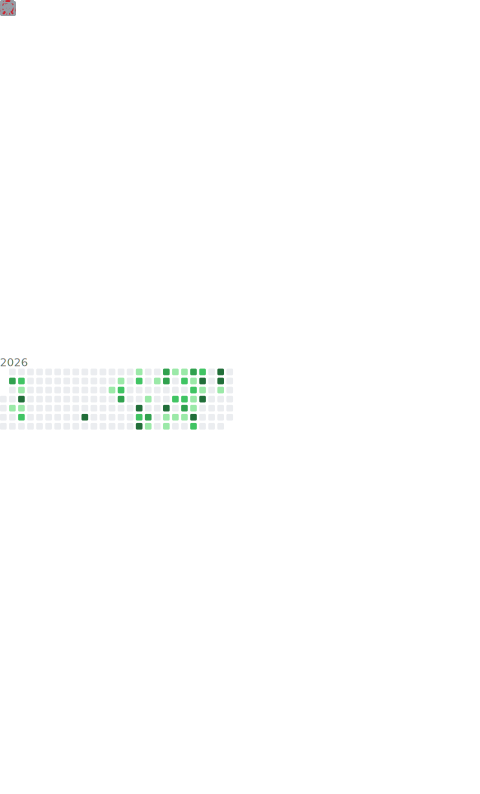

<h1 align="center">Hi 👋, I'm keaikeqing</h1>

<p align="left">  </p>

- 🌱 I'm currently learning **Swarm Intelligence**

- 📝 I regularly write articles on **[https://blog.keaikeqing.cn](https://blog.keaikeqing.cn)**

- 📫 How to reach me **<keaikeqing@gmail.com>**

<!-- 图片附加 -->
<p align="left">  </p>

<!-- <h5 align="left">Connect with me:</h5>
<p align="left">
<a href="https://leetcode.cn/u/keaikeqing/" target="blank"></a>
</p> -->

<h5 align="left">Languages and Tools:</h5>
<p align="left"> <a href="https://developer.mozilla.org/en-US/docs/Web/anaconda" target="_blank" rel="noreferrer">  </a> <a href="https://developer.mozilla.org/en-US/docs/Web/android" target="_blank" rel="noreferrer">  </a> <a href="https://developer.mozilla.org/en-US/docs/Web/azure" target="_blank" rel="noreferrer">  </a> <a href="https://developer.mozilla.org/en-US/docs/Web/bash" target="_blank" rel="noreferrer">  </a> <a href="https://developer.mozilla.org/en-US/docs/Web/bootstrap" target="_blank" rel="noreferrer">  </a> <a href="https://developer.mozilla.org/en-US/docs/Web/c" target="_blank" rel="noreferrer">  </a> <a href="https://developer.mozilla.org/en-US/docs/Web/chartjs" target="_blank" rel="noreferrer">  </a> <a href="https://developer.mozilla.org/en-US/docs/Web/cplusplus" target="_blank" rel="noreferrer">  </a> <a href="https://developer.mozilla.org/en-US/docs/Web/csharp" target="_blank" rel="noreferrer">  </a> <a href="https://developer.mozilla.org/en-US/docs/Web/css3" target="_blank" rel="noreferrer">  </a> <a href="https://developer.mozilla.org/en-US/docs/Web/d3js" target="_blank" rel="noreferrer">  </a> <a href="https://developer.mozilla.org/en-US/docs/Web/django" target="_blank" rel="noreferrer">  </a> <a href="https://developer.mozilla.org/en-US/docs/Web/docker" target="_blank" rel="noreferrer">  </a> <a href="https://developer.mozilla.org/en-US/docs/Web/flask" target="_blank" rel="noreferrer">  </a> <a href="https://developer.mozilla.org/en-US/docs/Web/git" target="_blank" rel="noreferrer">  </a> <a href="https://developer.mozilla.org/en-US/docs/Web/hexo" target="_blank" rel="noreferrer">  </a> <a href="https://developer.mozilla.org/en-US/docs/Web/html5" target="_blank" rel="noreferrer">  </a> <a href="https://developer.mozilla.org/en-US/docs/Web/huggingface" target="_blank" rel="noreferrer">  </a> <a href="https://developer.mozilla.org/en-US/docs/Web/java" target="_blank" rel="noreferrer">  </a> <a href="https://developer.mozilla.org/en-US/docs/Web/javascript" target="_blank" rel="noreferrer">  </a> <a href="https://developer.mozilla.org/en-US/docs/Web/jupyter" target="_blank" rel="noreferrer">  </a> <a href="https://developer.mozilla.org/en-US/docs/Web/kotlin" target="_blank" rel="noreferrer">  </a> <a href="https://developer.mozilla.org/en-US/docs/Web/langchain" target="_blank" rel="noreferrer">  </a> <a href="https://developer.mozilla.org/en-US/docs/Web/linux" target="_blank" rel="noreferrer">  </a> <a href="https://developer.mozilla.org/en-US/docs/Web/mariadb" target="_blank" rel="noreferrer">  </a> <a href="https://developer.mozilla.org/en-US/docs/Web/matlab" target="_blank" rel="noreferrer">  </a> <a href="https://developer.mozilla.org/en-US/docs/Web/matplotlib" target="_blank" rel="noreferrer">  </a> <a href="https://developer.mozilla.org/en-US/docs/Web/mysql" target="_blank" rel="noreferrer">  </a> <a href="https://developer.mozilla.org/en-US/docs/Web/nginx" target="_blank" rel="noreferrer">  </a> <a href="https://developer.mozilla.org/en-US/docs/Web/nodejs" target="_blank" rel="noreferrer">  </a> <a href="https://developer.mozilla.org/en-US/docs/Web/numpy" target="_blank" rel="noreferrer">  </a> <a href="https://developer.mozilla.org/en-US/docs/Web/ollama" target="_blank" rel="noreferrer">  </a> <a href="https://developer.mozilla.org/en-US/docs/Web/pandas" target="_blank" rel="noreferrer">  </a> <a href="https://developer.mozilla.org/en-US/docs/Web/php" target="_blank" rel="noreferrer">  </a> <a href="https://developer.mozilla.org/en-US/docs/Web/python" target="_blank" rel="noreferrer">  </a> <a href="https://developer.mozilla.org/en-US/docs/Web/pytorch" target="_blank" rel="noreferrer">  </a> <a href="https://developer.mozilla.org/en-US/docs/Web/redis" target="_blank" rel="noreferrer">  </a> <a href="https://developer.mozilla.org/en-US/docs/Web/sqlite" target="_blank" rel="noreferrer">  </a> <a href="https://developer.mozilla.org/en-US/docs/Web/tensorflow" target="_blank" rel="noreferrer">  </a></p>

<!--START_SECTION:waka-->


**I'm an Early 🐤** 

```text
🌞 Morning                374 commits         ██░░░░░░░░░░░░░░░░░░░░░░░   07.70 % 
🌆 Daytime                2285 commits        ████████████░░░░░░░░░░░░░   47.04 % 
🌃 Evening                1822 commits        █████████░░░░░░░░░░░░░░░░   37.51 % 
🌙 Night                  377 commits         ██░░░░░░░░░░░░░░░░░░░░░░░   07.76 % 
```
📅 **I'm Most Productive on Tuesday** 

```text
Monday                   665 commits         ███░░░░░░░░░░░░░░░░░░░░░░   13.69 % 
Tuesday                  877 commits         █████░░░░░░░░░░░░░░░░░░░░   18.05 % 
Wednesday                792 commits         ████░░░░░░░░░░░░░░░░░░░░░   16.30 % 
Thursday                 691 commits         ████░░░░░░░░░░░░░░░░░░░░░   14.22 % 
Friday                   660 commits         ███░░░░░░░░░░░░░░░░░░░░░░   13.59 % 
Saturday                 611 commits         ███░░░░░░░░░░░░░░░░░░░░░░   12.58 % 
Sunday                   562 commits         ███░░░░░░░░░░░░░░░░░░░░░░   11.57 % 
```


📊 **This Week I Spent My Time On** 

```text
💬 Programming Languages: 
Markdown                 7 hrs 41 mins       ███████████░░░░░░░░░░░░░░   42.86 % 
TeX                      3 hrs 35 mins       █████░░░░░░░░░░░░░░░░░░░░   20.02 % 
JSON                     1 hr 25 mins        ██░░░░░░░░░░░░░░░░░░░░░░░   07.90 % 
XML                      1 hr 18 mins        ██░░░░░░░░░░░░░░░░░░░░░░░   07.32 % 
C#                       1 hr 11 mins        ██░░░░░░░░░░░░░░░░░░░░░░░   06.65 % 

🔥 Editors: 
VS Code                  12 hrs 29 mins      █████████████████░░░░░░░░   69.59 % 
Visual Studio            2 hrs 24 mins       ███░░░░░░░░░░░░░░░░░░░░░░   13.44 % 
Codex CLI                2 hrs 18 mins       ███░░░░░░░░░░░░░░░░░░░░░░   12.83 % 
Antigravity              22 mins             █░░░░░░░░░░░░░░░░░░░░░░░░   02.10 % 
Claude Code              21 mins             █░░░░░░░░░░░░░░░░░░░░░░░░   02.04 % 
```


 Last Updated on 10/06/2026 05:03:10 UTC
<!--END_SECTION:waka-->
