<h1 align="center">Hi 👋, I'm keaikeqing</h1>
<h3 align="center">A passionate developer from China</h3>

<p align="left">  </p>

<p align="left"> <a href="https://github.com/ryo-ma/github-profile-trophy"></a> </p>

- 🔭 I’m currently working on [keaikeqing.github.io](blog.keaikeqing.me)

- 🌱 I’m currently learning **LLM WinUI Android Web**

- 📝 I regularly write articles on [blog.keaikeqing.me](blog.keaikeqing.me)

- 📫 How to reach me **<keaikeqing@gmail.com>**

<!-- 图片附加 -->
<p align="left">  </p>

<!-- <h5 align="left">Connect with me:</h5>
<p align="left">
<a href="https://leetcode.cn/u/keaikeqing/" target="blank"></a>
</p> -->

<h5 align="left">Languages and Tools:</h5>
<p align="left"> <a href="https://developer.android.com" target="_blank" rel="noreferrer">  </a> <a href="https://azure.microsoft.com/en-in/" target="_blank" rel="noreferrer">  </a> <a href="https://www.gnu.org/software/bash/" target="_blank" rel="noreferrer">  </a> <a href="https://getbootstrap.com" target="_blank" rel="noreferrer">  </a> <a href="https://canvasjs.com" target="_blank" rel="noreferrer">  </a> <a href="https://www.chartjs.org" target="_blank" rel="noreferrer">  </a> <a href="https://www.w3schools.com/cpp/" target="_blank" rel="noreferrer">  </a> <a href="https://www.w3schools.com/cs/" target="_blank" rel="noreferrer">  </a> <a href="https://www.w3schools.com/css/" target="_blank" rel="noreferrer">  </a> <a href="https://www.djangoproject.com/" target="_blank" rel="noreferrer">  </a> <a href="https://www.docker.com/" target="_blank" rel="noreferrer">  </a> <a href="https://flask.palletsprojects.com/" target="_blank" rel="noreferrer">  </a> <a href="https://git-scm.com/" target="_blank" rel="noreferrer">  </a> <a href="hexo.io/" target="_blank" rel="noreferrer">  </a> <a href="https://www.w3.org/html/" target="_blank" rel="noreferrer">  </a> <a href="https://www.java.com" target="_blank" rel="noreferrer">  </a> <a href="https://developer.mozilla.org/en-US/docs/Web/JavaScript" target="_blank" rel="noreferrer">  </a> <a href="https://jekyllrb.com/" target="_blank" rel="noreferrer">  </a> <a href="https://kotlinlang.org" target="_blank" rel="noreferrer">  </a> <a href="https://www.linux.org/" target="_blank" rel="noreferrer">  </a> <a href="https://www.mathworks.com/" target="_blank" rel="noreferrer">  </a> <a href="https://www.mysql.com/" target="_blank" rel="noreferrer">  </a> <a href="https://www.nginx.com" target="_blank" rel="noreferrer">  </a> <a href="https://pandas.pydata.org/" target="_blank" rel="noreferrer">  </a> <a href="https://www.photoshop.com/en" target="_blank" rel="noreferrer">  </a> <a href="https://www.python.org" target="_blank" rel="noreferrer">  </a> <a href="https://pytorch.org/" target="_blank" rel="noreferrer">  </a> <a href="https://www.sqlite.org/" target="_blank" rel="noreferrer">  </a> <a href="https://www.tensorflow.org" target="_blank" rel="noreferrer">  </a> </p>

<!--START_SECTION:waka-->


**I'm an Early 🐤** 

```text
🌞 Morning                238 commits         ██░░░░░░░░░░░░░░░░░░░░░░░   06.60 % 
🌆 Daytime                1643 commits        ███████████░░░░░░░░░░░░░░   45.58 % 
🌃 Evening                1419 commits        ██████████░░░░░░░░░░░░░░░   39.36 % 
🌙 Night                  305 commits         ██░░░░░░░░░░░░░░░░░░░░░░░   08.46 % 
```
📅 **I'm Most Productive on Tuesday** 

```text
Monday                   471 commits         ███░░░░░░░░░░░░░░░░░░░░░░   13.07 % 
Tuesday                  789 commits         █████░░░░░░░░░░░░░░░░░░░░   21.89 % 
Wednesday                507 commits         ████░░░░░░░░░░░░░░░░░░░░░   14.06 % 
Thursday                 473 commits         ███░░░░░░░░░░░░░░░░░░░░░░   13.12 % 
Friday                   425 commits         ███░░░░░░░░░░░░░░░░░░░░░░   11.79 % 
Saturday                 466 commits         ███░░░░░░░░░░░░░░░░░░░░░░   12.93 % 
Sunday                   474 commits         ███░░░░░░░░░░░░░░░░░░░░░░   13.15 % 
```


📊 **This Week I Spent My Time On** 

```text
💬 Programming Languages: 
C#                       4 hrs 12 mins       ██████████░░░░░░░░░░░░░░░   39.32 % 
Python                   3 hrs 1 min         ███████░░░░░░░░░░░░░░░░░░   28.23 % 
Binary                   1 hr                ██░░░░░░░░░░░░░░░░░░░░░░░   09.48 % 
Other                    49 mins             ██░░░░░░░░░░░░░░░░░░░░░░░   07.68 % 
YAML                     36 mins             █░░░░░░░░░░░░░░░░░░░░░░░░   05.65 % 

🔥 Editors: 
VS Code                  7 hrs               ████████████████░░░░░░░░░   65.48 % 
Visual Studio            3 hrs 41 mins       █████████░░░░░░░░░░░░░░░░   34.52 % 
```


 Last Updated on 10/05/2025 02:16:49 UTC
<!--END_SECTION:waka-->
